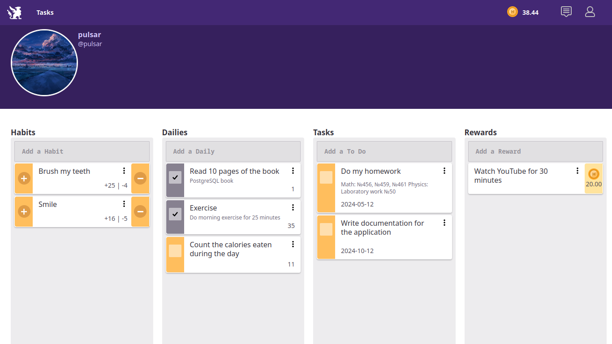
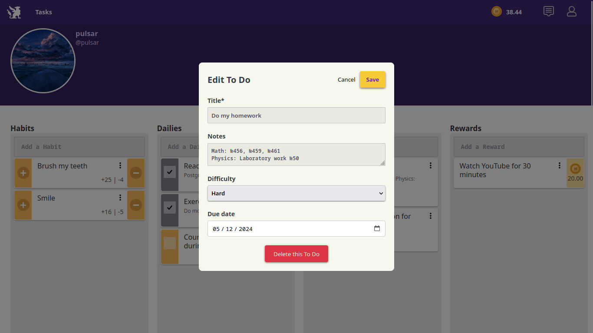

# Habitica

**Habitica** - is a application that is designed to improve personal effectiveness. It helps to manage habits, daily activities and tasks, allowing users to track their progress towards their goals while staying motivated. Staying motivated is helped by rewards that the user can come up with on their own.

## Main functions

- 📝**Creating, deleting and editing tasks**
- 👤**Setting the user's avatar**
- 🏆**Reward system to increase motivation**
- 📆**Managing habits with the ability to reset them**
- 📊**Statistics on habits and daily activities**

## Screenshots






## Requirements

Before installing, make sure that the following components are installed on the your computer:

- Java 17(or higher)
- Tomcat Server
- Maven 3.6+
- PostgreSQL
- Git


## Installation and launch

1. **Go to the required directory and clone the project:**

```bash
git clone https://github.com/pulsarmn/Habitica.git
```

2. **Go to the project directory:**

```bash
cd project-dir/
```

3. **Configure the database:**

- Initialize the database:

```bash
psql -U username postgres # or psql postgres

CREATE DATABASE databaseName; # create a database

\c databaseName # connect to the database

\i src/main/resources/db/database.sql # execute commands from file
```

- Specify the database connection parameters in the **src/main/resources/application.properties** file:

```properties
db.url=jdbc:postgresql://localhost:5432/databaseName  
db.user=username 
db.password=userPassword
```

4. **Specify the path to tomcat in the src/main/resources/application.properties:**

```properties
image.base.path=/static/images/user-avatars  
image.empty.avatar=/static/images/user-avatars/empty-avatar.png  
image.root.path=/home/pulsar/IdeaProjects/--ProjectName--/src/main/webapp  
image.deploy.path=$TOMCAT_HOME/webapps/ROOT
```

5. **Install dependencies:**

```bash
mvn clean install
```

6. **Move ROOT.war to $TOMCAT_HOME/webapps**

```bash
mv target/ROOT.war $TOMCAT_HOME/webapps
```

7. **Launch tomcat:**

```bash
$TOMCAT_HOME/bin/./catalina.sh
```

8. **Open a browser and go to:**

```
http://localhost:8080
```


## Authors

- **pulsarmn**
